# Capstone Project

## Purpose of the Project

The purpose of the capstone project is to combine what I learned from the Data Engineering Nanodegree Program.

The Airbnb dataset was gathered, analyzed, and modeled. It was aimed to easily use by business units, data scientists. Also, database can be used to create queries for the Airbnb dataset. Users can find answers for questions such as "How many listings are available ?",  "What is the relationship between reviews and listings?", "What are the features of the listings that get the good/bad reviews?".

## Scripts

- create_tables.sql : SQL for creating tables on redshift datawarehouse.
- sql_queries.py : Insert scripts for tables.
- data_quality.py : Checking row counts of table to ensure data quality.
- load_dimenison.py : Loading dimension tables from fact tables.
- load_fact.py :  Loading fact tables from staging tables
- stage_redshift.py : Loading data from CSV files on S3 to Redshift staging tables.

## Data Sources

Data was gathered from [kaggle.](https://www.kaggle.com/samyukthamurali/airbnb-ratings-dataset) This dataset contains the list of houses to be rented in New York, Los Angeles and the comments made by the users about these houses. For the project, two following files were used :

**NY_Listings.csv**
Includes 75.749 rows about the rentable houses. Columns information :

|          Listings            |
|-----------------------------|
| Listing ID                  |
| Name                        |
| Host ID                     |
| Host Name                   |
| Host Response Rate          |
| Host Is Superhost           |
| Host total listings count   |
| Street                      |
| City                        |
| Neighbourhood cleansed      |
| State                       |
| Country                     |
| latitude                    |
| longitude                   |
| Property type               |
| Room type                   |
| Accommodates                |
| Bathrooms                   |
| Bedrooms                    |
| Amenities                   |
| Price                       |
| Minimum nights              |
| Maximum nights              |
| Availability 365            |
| Calendar last scraped       |
| Number of reviews           |
| Last Review Date            |
| Review Scores Rating        |
| Review Scores Accuracy      |
| Review Scores Cleanliness   |
| Review Scores Checkin       |
| Review Scores Communication |
| Review Scores Location      |
| Review Scores Value         |
| Reviews per month           |

**airbnb-reviews.csv** Includes  14.864.421 rows about the reviews of customers. Columns information :

| airbnb-reviews |
|----------------|
| listing_id     |
| id             |
| date           |
| reviewer_id    |
| reviewer_name  |
| comments       |

Explore and Assess the Data :
- Null variables were determined. Null variables was written as 'NA' in raw files. To upload this fields on Redshift, defined as "NULL AS 'NA'" in copy sql statement.
- Csv files include header.
- String may contains invalid or unsupported UTF8 codepoints. To fix this, acceptinvchars statement is added to copy sql statement that move data from S3 to Redshift.
- Determined max length of strings. Some columns type like amenities are defined as varchar(max).
- Checked primary keys values in case they can be null.
- Checked duplicated primary keys in dimension tables.

## Used Technologies

<ol>
<li> S3: Provides a platform for storage of data in the form of objects. In the project, log files were stored in the S3. It was located to the Amazon Service. </li>
<li> AWS Redshift: It is fast, simple, cost-effective data warehousing service In the project, it was used loading data from S3 into relational database. It was located to the Amazon clusters. </li>
<li> Airflow :It is a workflow automation and scheduling system that can be used to author and manage data pipelines. In the project, it was used to schedule and maintain etl jobs. </li>
<li> Redshift Query Editor : After loading tables in Redshift, it was used to check data quality.</li>
</ol>

## Prerequisites

- Before running dag, tables must be created on Redshift with using this file:

  create_tables.sql

- Csv files must be uploaded to S3 bucket :
<ol>
<li>Listing data: s3://airbnb-review/listing
<li>Review data: s3://airbnb-review/reviews
</ol>

## Database Design

**Staging Tables**

<ol>
<li>staging_listings: records from s3://airbnb-review/listing to table

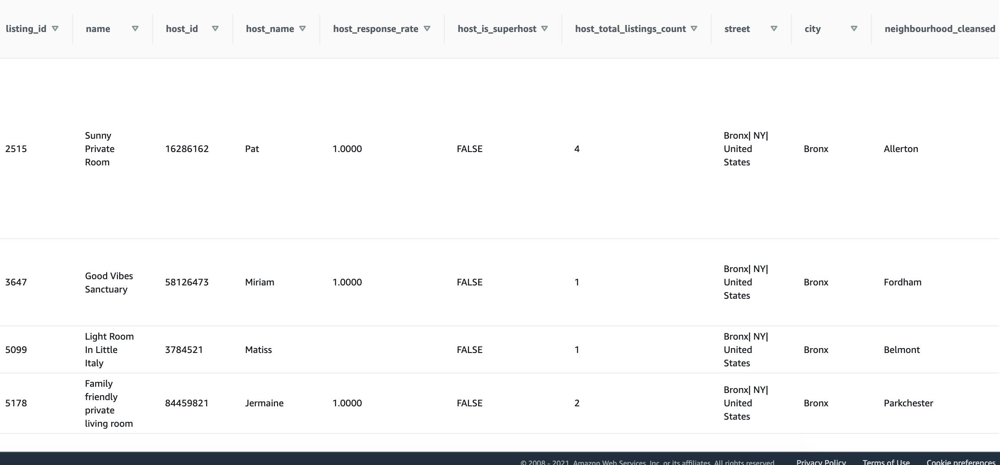
* All columns of the table are not shown in the picture.

</li>
<li>staging_reviews : records from s3://airbnb-review/reviews to  table

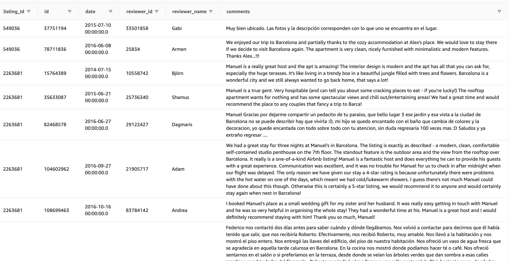

</ol>

**Fact Tables**
<ol>
<li>listing: records from  staging_listings tables. Includes listing information.

| Column                      | Type             | Description                                                                                  |
|-----------------------------|------------------|----------------------------------------------------------------------------------------------|
| listing_id                  | varchar(256)     | listing identifier and primary key of the table                                              |
| name                        | varchar(256)     | listing name                                                                                 |
| host_id                     | varchar(256)     | host identifier and primary key of the hosts table                                           |
| latitude                    | DOUBLE PRECISION | location identifier and one of the primary keys of the locations table with longitude field. |
| longitude                   | DOUBLE PRECISION | location identifier and one of the primary keys of the locations table with latitude field.  |
| property_type               | varchar(256)     | apartment /house info                                                                        |
| room_type                   | varchar(256)     | entire house / private room etc. info                                                        |
| accommodates int8           | int8             | Maximum number of people can stay in the place to be rented                                  |
| bathrooms                   | decimal(8,4)     | number of the bathrooms in house                                                             |
| bedrooms                    | decimal(8,4)     | number of the bedrooms in house                                                              |
| amenities                   | varchar(max)     | facilities information such as pool,internet                                                 |
| price                       | numeric(18,0)    | daily price of listing                                                                       |
| minimum_nights              | int8             | information of how many nights you have to stay at least                                     |
| maximum_nights              | int8             | information of how many nights you have to stay at most                                      |
| availability_365            | int8             | an indicator of the total number of days the listing is available for during the year        |
| calendar_last_scraped       | timestamp        | not enough information found                                                                 |
| number_of_reviews           | int8             | Total number of comments about the listing                                                   |
| last_review_date            | timestamp        | last review date                                                                             |
| review_scores_rating        | int8             | not enough information found                                                                 |
| review_scores_accuracy      | int8             | not enough information found                                                                 |
| review_scores_cleanliness   | int8             | not enough information found                                                                 |
| review_scores_checkin       | int8             | not enough information found                                                                 |
| review_scores_communication | int8             | not enough information found                                                                 |
| review_scores_location      | int8             | not enough information found                                                                 |
| review_scores_value         | int8             | not enough information found                                                                 |
| reviews_per_month           | numeric(18,0)    | insights into frequency of visits of the listing                                             |

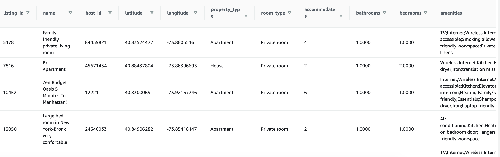

*All columns of the table are not shown in the picture

 </li>
<li>reviews : records from staging_reviews table if listing id associated with listings table. Includes comments information of reviewers.

| Column      | Type         | Description                                                  |
|-------------|--------------|--------------------------------------------------------------|
| listing_id  | varchar(256) | listing identifier and primary key of the listing fact table |
| id          | varchar(256) | review identifier and primary key of the table               |
| date        | timestamp    | Review date                                                  |
| reviewer_id | varchar(256) | reviewer identifier and primary key of the reviewers table   |
| comments    | varchar(max) | Reviewer's comments about the listing                        |

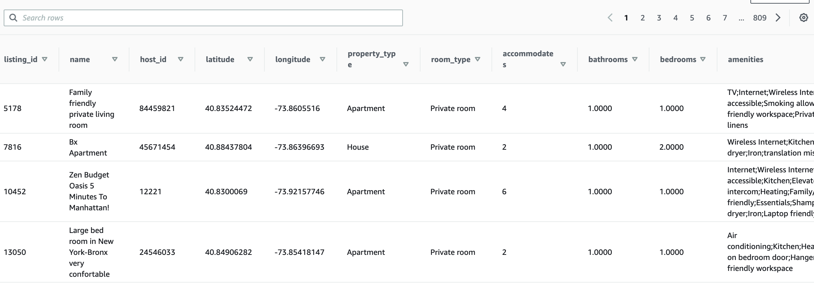

</li>
</ol>

**Dimension Tables**
<ol>
<li>hosts: hosts information

| Column                    | Type         | Description                                                                                                      |
|---------------------------|--------------|------------------------------------------------------------------------------------------------------------------|
| host_id                   | varchar(256) | host identifier and primary key of table                                                                         |
| host_name                 | varchar(256) | host name                                                                                                        |
| host_response_rate        | decimal(8,4) | how consistently host respond within 24 hours to guest inquiries and booking requests.                           |
| host_is_superhost         | varchar(256) | experienced hosts who provide a shining example for other hosts, and extraordinary experiences for their guests. |
| host_total_listings_count | int8         | the number of listings host has                                                                                  |

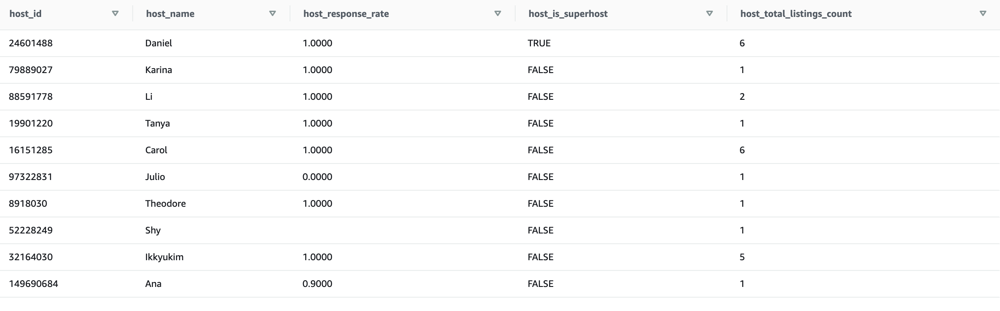

</li>
<li>locations : location of listings

| Column                 | Type             | Description                                                   |
|------------------------|------------------|---------------------------------------------------------------|
| latitude               | DOUBLE PRECISION | latitude information of listing and one of the keys of table  |
| longitude              | DOUBLE PRECISION | longitude information of listing and one of the keys of table |
| street                 | varchar(256)     | street information of listing                                 |
| city                   | varchar(256)     | city information of listing                                   |
| neighbourhood_cleansed | varchar(256)     | neighbourhood information of listing                          |
| state                  | varchar(256)     | state information of listing                                  |
| country                | varchar(256)     | country information of listing                                |

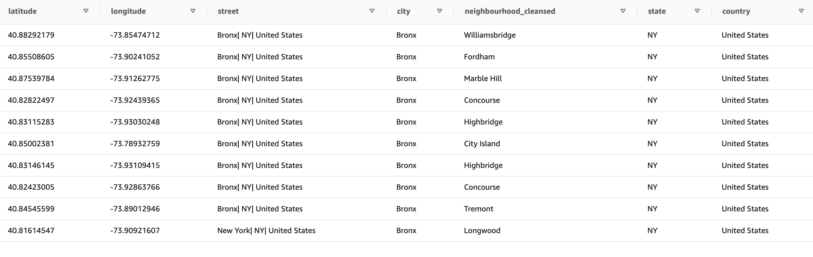
</li>
<li>reviewers : users who write commments for listing

| Column        | Type         | Description                                       |
|---------------|--------------|---------------------------------------------------|
| reviewer_id   | varchar(256) | reviewer identifier and  primary key of the table |
| reviewer_name | varchar(256) | reviewer name                                     |

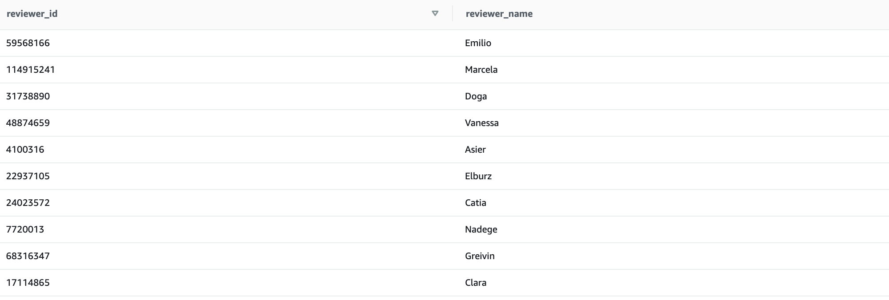
</li>
<li>time : timestamps of records in reviews broken down into specific units

| Column    | Type      | Description                                    |
|-----------|-----------|------------------------------------------------|
| date      | timestamp | timestamps identifier and primary key of table |
| hour      | int4      | hour information of date                       |
| day       | int4      | day information of date                        |
| week      | int4      | week information of date                       |
| month     | int4      | month information of date                      |
| year      | int4      | year information of date                       |
| dayofweek | int4      | day of weeek information of date               |

</li>
</ol>

Database design below :

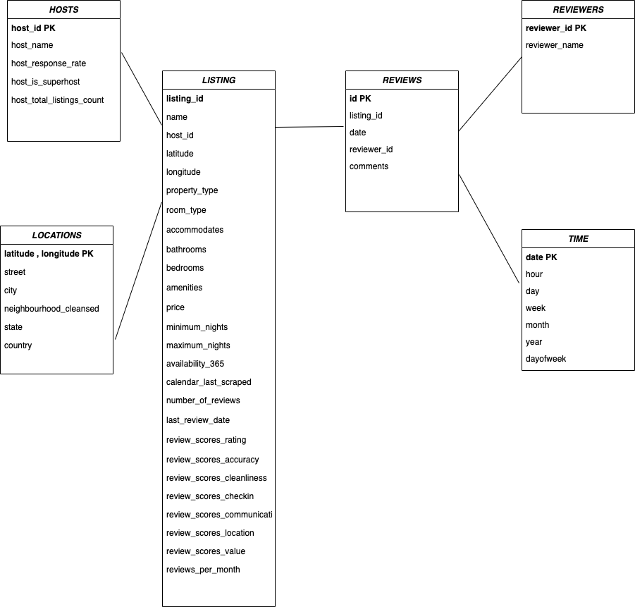

- For database design, star schema is chosen to simplify joins and meet business-technical needs with flexibility.
- Listing fact table is created from staging_listings. Reviews fact table is created from staging_reviews table. They are centered of the database design. Because they contain keys of dimension tables.
- With this design, users can find relation between listing and reviews.

## ETL Pipeline

ETL Design below :

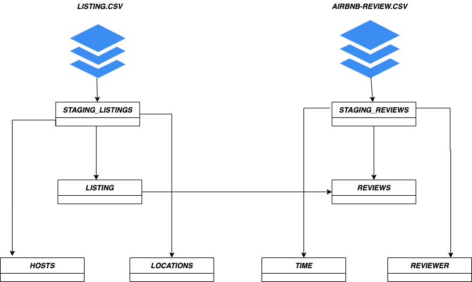

Airflow graph view :

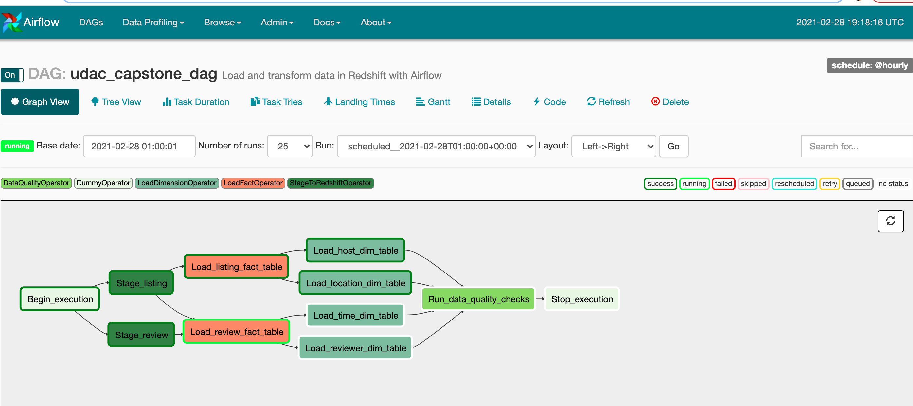

Airflow tree view :

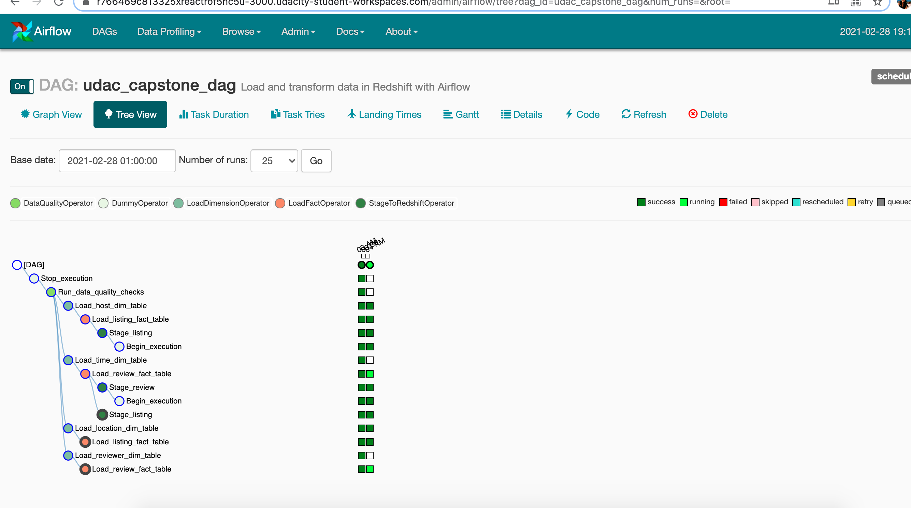

Airflow execution time :

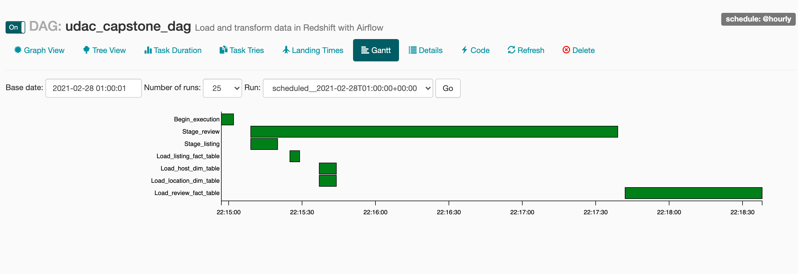

## Scenarios

- If the data was increased by 100x :

  - Apache Spark can be used to processing data. Because Spark is a fast and general engine for large-scale data processing.
  -  Redshift is a distributed database so adding nodes will increased the writing and reading speed. Also distributed keys can be added to the tables.

- If the pipelines were run on a daily basis by 7am :
  - Data is kept up-to-date.
  - In addition, it allows early intervention in case of a possible error in the morning.
  - Warning features can be added to dag in case of a possible error.
  - If data is increased, dag's running time can be changed and loading speed can be decreased. It causes systems crush. In this situation, I recommend to run pipelines on at least hourly basis.

- If the database needed to be accessed by 100+ people :

  With Amazon Redshift, it can be accessed by this number of people without living any performance issues. If resources still are not enough, nodes can be added to Redshift cluster.
