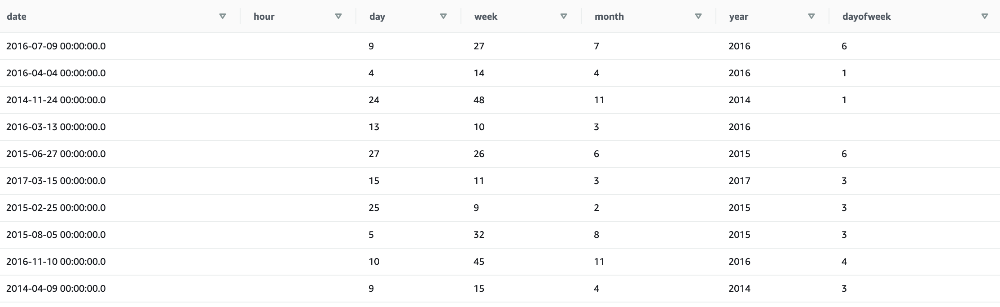

# Capstone Project

## Purpose of the Project

The purpose of the capstone project is to combine what I learned from the Data Engineering Nanodegree Program.

The Airbnb dataset was gathered, analyzed, and modeled. It was aimed to easily use by business units, data scientists. Also, database can be used to create queries for the Airbnb dataset. Users can find answers for questions such as "How many listings are available ?",  "What is the relationship between reviews and listings?", "What are the features of the listings that get the good/bad reviews?".

## Scripts

- create_tables.sql : SQL for creating tables on redshift datawarehouse.
- sql_queries.py : Insert scripts for tables.
- data_quality.py : Checking row counts of table to ensure data quality.
- load_dimenison.py : Loading dimension tables from fact tables.
- load_fact.py :  Loading fact tables from staging tables
- stage_redshift.py : Loading data from CSV files on S3 to Redshift staging tables.

## Data Sources

Data was gathered from [kaggle.](https://www.kaggle.com/samyukthamurali/airbnb-ratings-dataset?select=NY_Listings.csv) This dataset contains the list of houses to be rented in New York, Los Angeles and the comments made by the users about these houses. For the project, two following files were used :

**NY_Listings.csv**
Includes 75.749 rows about the rentable houses. Columns information :

|          Listings            |
|-----------------------------|
| Listing ID                  |
| Name                        |
| Host ID                     |
| Host Name                   |
| Host Response Rate          |
| Host Is Superhost           |
| Host total listings count   |
| Street                      |
| City                        |
| Neighbourhood cleansed      |
| State                       |
| Country                     |
| latitude                    |
| longitude                   |
| Property type               |
| Room type                   |
| Accommodates                |
| Bathrooms                   |
| Bedrooms                    |
| Amenities                   |
| Price                       |
| Minimum nights              |
| Maximum nights              |
| Availability 365            |
| Calendar last scraped       |
| Number of reviews           |
| Last Review Date            |
| Review Scores Rating        |
| Review Scores Accuracy      |
| Review Scores Cleanliness   |
| Review Scores Checkin       |
| Review Scores Communication |
| Review Scores Location      |
| Review Scores Value         |
| Reviews per month           |

**airbnb-reviews.csv** Includes  14.864.421 rows about the reviews of customers. Columns information :

| airbnb-reviews |
|----------------|
| listing_id     |
| id             |
| date           |
| reviewer_id    |
| reviewer_name  |
| comments       |

Explore and Assess the Data :
- Null variables were determined. Null variables was written as 'NA' in raw files. To upload this fields on Redshift, defined as "NULL AS 'NA'" in copy sql statement.
- Csv files include header.
- String may contains invalid or unsupported UTF8 codepoints. To fix this, acceptinvchars statement is added to copy sql statement that move data from S3 to Redshift.
- Determined max length of strings. Some columns type like amenities are defined as varchar(max).
- Checked primary keys values in case they can be null.

## Used Technologies

<ol>
<li> S3: To storage for CSV files</li>
<li> AWS Redshift: To create data datawarehouse</li>
<li> Airflow : To schedule etl process</li>
<li> Redshift Query Editor : To check tables, control data.</li>
</ol>

## Prerequisites

- Before running dag, tables must be created on Redshift with using this file:

  create_tables.sql

- Csv files must be uploaded to S3 bucket :
<ol>
<li>Listing data: s3://airbnb-review/listing
<li>Review data: s3://airbnb-review/reviews
</ol>

## Database Design

**Staging Tables**

<ol>
<li>staging_listings: records from s3://airbnb-review/listing to table

* All columns of the table are not shown in the picture.

</li>
<li>staging_reviews : records from s3://airbnb-review/reviews to  table

</ol>

**Fact Tables**
<ol>
<li>listing: records from  staging_listings tables. Includes listing information

*All columns of the table are not shown in the picture

 </li>
<li>reviews : records from staging_reviews table if listing id associated with listings table. Includes comments information of reviewers

</li>
</ol>

**Dimension Tables**
<ol>
<li>hosts: hosts information

</li>
<li>locations : location of listings

</li>
<li>reviewers : users who write commments for listing

</li>
<li>time : timestamps of records in reviews broken down into specific units

</li>
</ol>

Database design below :

## ETL Pipeline

ETL Design below :

Airflow graph view :

Airflow tree view :

Airflow execution time :

## Scenarios

- If the data was increased by 100x :

  Apache Spark can be used to processing data.
- If the pipelines were run on a daily basis by 7am :

  Data is kept up-to-date. In addition, it allows early intervention in case of a possible error in the morning. Warning features can be added to Dag in case of a possible error.

- If the database needed to be accessed by 100+ people :

  With Amazon Redshift, it can be accessed by this number of people without living any performance issues.
